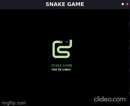

# Snake-game Using Python and Pygame
---
Who has not played the historic *[Snake](https://www.itsnicethat.com/features/taneli-armanto-the-history-of-snake-design-legacies-230221)* game on Nokia mobile phones. Still to this day Still, to this very day, people of all ages will have heard of Snake – they might have even played the original, or know an older person who has. I myself was addicted to the game back in my childhood. Though modern games have advanced user interfaces and better graphics, I still miss that excitement while playing them. I always wanted to recreate that excitement and feeling, Thanks to the programming languages which allow us to build such cool stuffs.

## Description
---
The project aims to build a simple snake game using *[Python](https://www.python.org/)* and an *[Open-source](https://en.wikipedia.org/wiki/Open_source)* cross-platform library called *[Pygame](https://www.pygame.org/wiki/about)*. Though the project does not include all the functionaities of the game, It develops a simple game which is controlled by arrow keys on the keyboard. The game also records the users best score. It displays users current score on the window. Though its just a basic game it is good for beginners to get hands on experience with python and the pygame library.

<h1> Here's a glimpse of the game </h1>

  

